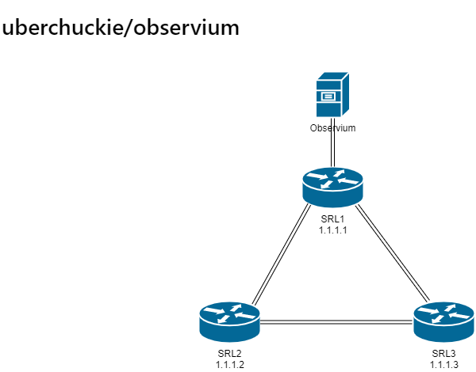

# Lab 2

## Description

In the second lab we will change the manual SNMP server with [Observium](https://www.observium.org/) network monitor. We'll also add a couple of routers with links between them.

Lab consists of 3 Nokia Linux SR routers and 1 server
* Observium monitoring, 10.10.20.2
* Srl1, 1.1.1.1
* Srl2, 1.1.1.2
* Srl3, 1.1.1.3

Server is connected to SRL1, and the routers are connected to eachother with direct links. Routing between them is done with OSPF.

## Deployment

Deploy the lab with command `./deploy.sh lab2`

SNMP is version 2c, the community string is `lab2` (snmpwalk -v 2c -c lab2 x.x.x.x OID). The devices are already added to observium.

The usable OIDs and instructions for configurating Nokia SR Linux can be found from Nokia's web page [Nokia Service Router Linux](https://documentation.nokia.com/cgi-bin/dbaccessfilename.cgi/3HE16819AAAATQZZA01_V1_SR%20Linux%20R21.3%20Configuration%20Basics.pdf)

You can enter the server console with command `./server.sh lab2 observium` and the routers CLI with command `./srl.sh lab2 <router number>`

Observium username and password is `lab2 / lab2` and can be accessed by web browser http://localhost:8102

## Task

Observium is showing three alarms that are connected to the same fault. Investigate the alarm with observium and fix the device configuration as needed. Use Nokia SR Linux documentation to help with the commands.

Hint: You can see each ports current status from port event log.

## Cleanup
After the lab is done remember to destroy the lab with command `./destroy.sh lab2`